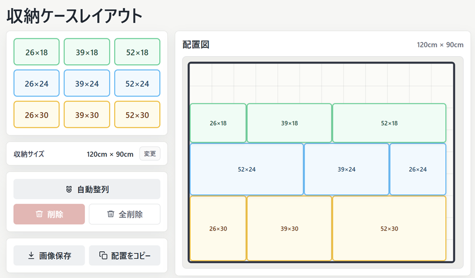

# 収納ケースレイアウト

ニトリの「組合せ可能な収納ケース」の配置を、購入前に試すための小さなシミュレーターです。

公開URL:

- [https://app.akiplaylab.com/storage-case-layout/](https://app.akiplaylab.com/storage-case-layout/)



対象にしている商品:

- [組合せ可能な収納ケース 幅52cm×高さ24cm NS5224](https://www.nitori-net.jp/ec/product/8431064s/)

## このアプリについて

ニトリの「組合せ可能な収納ケース」は、幅違いのケースを組み合わせて収納スペースに合わせられるのが魅力です。だからこそ、買う前に「この幅に本当に収まるのか」「どのサイズを何個買えばよいのか」「並べ方を変えるとどう見えるのか」を試したくなります。

ところが、少なくとも作成時点では、手元の収納スペースに合わせて配置を試せるシミュレーターを見つけられませんでした。自分でも購入前にかなり悩んだので、その確認をするために作ったのがこのアプリです。

## できること

- 収納スペースの幅と高さをcm単位で設定
- 26cm / 39cm / 52cm幅、18cm / 24cm / 30cm高さのケースを追加
- 配置図上でケースをドラッグして移動
- 左下詰めで自動整列
- 収納スペースからはみ出しているケースや、重なっているケースを警告
- 配置図をPNG画像として保存
- 配置内容をテキストとしてコピー

## 注意

このアプリはニトリ公式のアプリではありません。購入前の検討を助けるための非公式ツールです。

実際に購入する前には、必ずニトリ公式サイトの商品ページで最新の仕様、サイズ、注意事項を確認してください。公式ページでは、幅違いでも組み合わせできること、積み重ねは3段までであることなどが案内されています。

## ローカル確認

`index.html` をダブルクリックしてブラウザで開けば確認できます。

## サーバーへの配置

次の3ファイルを、公開したいドメインまたはサブディレクトリへアップロードします。

```text
index.html
app.js
styles.css
```

`index.html` から `./app.js` と `./styles.css` を相対パスで読んでいるため、サブディレクトリ配下でも動作します。
